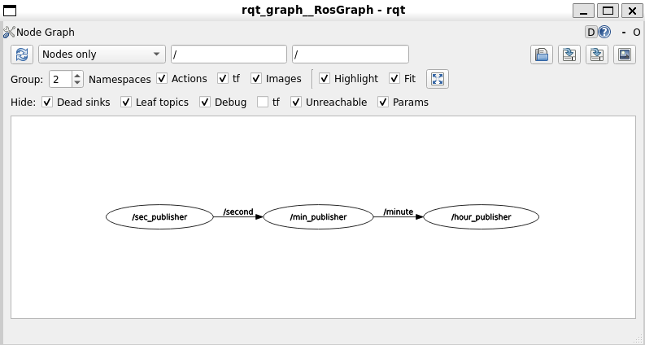

# Week 3 Submission - Prathamesh

## Package Name
`kratos_prathamesh`

#---------------------------------------------------------------------------------------------------

## Question-wise Code Mapping

| Question | File(s)                                                   | Description |
|----------|----------------------------------------------             |-------------|
| Q1       | `q1/q1_publisher_member_function.py`                      | Simple ROS 2 publisher |
| Q2       | `q2/q2_s1publisher_node.py`, `q2/q2_s2subscriber_node.py` | Publisher & subscriber using standard messages |
| Q3       | `q3/q3_description.py`                                    | Uses custom message to represent rover status |
| Q4       | `q4/clock_publisher.py`, `hour_publisher.py`, etc.        | Publishes clock components separately |
| Bonus    | `bonus_q/action/Arm.action` `bonus_actionclient.py` `bonus_actionserver.py` | Action server and client to rotate robotic arm with feedback           |

#---------------------------------------------------------------------------------------------------

## RQT Graph (Question 4)

## Order to run
Q1:
    q1_publisher_member_function
    q1_publisher_member_function

Q2:
    q2_s2subscriber_node
    q2_s1publisher_node

Q3:
    --well--

Q4:
    min_publisher
    sec_publisher
    hour_publisher
    clock_publisher

bonus:
    bonus_actionclient
    bonus_actionserver    
